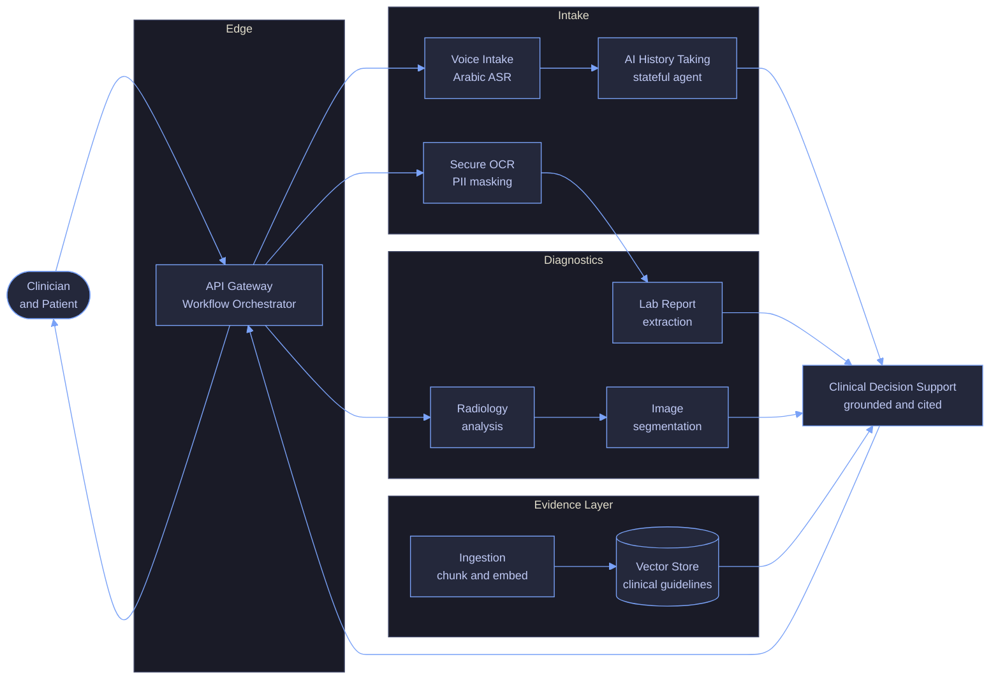

<!--
  ===========================================================================
   Ahmed Nashat Noaman - GitHub profile README
  ---------------------------------------------------------------------------
   Regions wrapped in HTML comment markers named KEY:START / KEY:END are
   generated by scripts/sync_profile.py and rebuilt nightly by the
   .github/workflows/profile-sync.yml pipeline.

   To change their content, edit profile.config.json - never edit inside a
   marker, your changes will be overwritten on the next run.
   Everything outside the markers is hand-written and safe to edit directly.

   Design system and colour tokens: DESIGN.md
  ===========================================================================
-->

<div align="center">


<a href="https://github.com/ahmednashatnoaman-svg">
  
</a>

<br/>

<a href="mailto:ahmadnashat1999@gmail.com"></a>
<a href="https://www.linkedin.com/in/ahmed-nashat1/"></a>
<a href="https://github.com/ahmednashatnoaman-svg?tab=repositories"></a>


<a href="https://github.com/ahmednashatnoaman-svg?tab=followers"></a>


</div>

## &nbsp;🧭&nbsp; About


I build **AI systems that carry a business case**, not just a benchmark score.

My background is deliberately hybrid: a **BSc and MSc in Mechanical Power Engineering**
taught me to model systems from first principles, an **MBA in Global Management** taught
me to price the decision that follows, and the **ITI AI & Machine Learning program**
gave me the engineering to ship it.

That combination shows up in the work — retrieval pipelines for clinical decision
support, Lambda-architecture forecasting on Spark and Kafka, multi-agent career tooling,
and a voice assistant for blind and low-vision users. Each one starts from a real
constraint and ends at something deployable.

**Currently:** AI & ML trainee at **ITI**, MBA candidate at **ESLSCA Paris Business
School**, and MSc researcher at **Mansoura University**.

<br clear="right"/>

<!-- FOCUS:START -->
| | | |
| :---: | :--- | :--- |
| 🚀 | **Currently building** | Agentic AI and RAG systems for clinical decision support |
| 🌱 | **Currently learning** | LLM evaluation, MLOps on AWS, and distributed inference |
| 🤝 | **Open to collaborate on** | Applied AI for healthcare, supply chain and accessibility |
| 💬 | **Ask me about** | RAG pipelines, PySpark, LangGraph, forecasting, BIM |
| ⚡ | **Fun fact** | I model heat transfer and multi-agent graphs with the same appetite |
<!-- FOCUS:END -->

<div align="center">

<!-- STATS:START -->
<div align="center">
  
  
  
  
  
  
</div>
<!-- STATS:END -->

</div>


## &nbsp;🛠️&nbsp; Tech Arsenal

<!-- TECH:START -->
<div align="center">

<h4>Languages & Core</h4>

<a href="https://skillicons.dev"></a>


<br/>

<h4>AI · Machine Learning · Deep Learning</h4>

<a href="https://skillicons.dev"></a>


<br/>

<h4>LLMs · GenAI · Agents</h4>


<br/>

<h4>Data Engineering & Big Data</h4>

<a href="https://skillicons.dev"></a>


<br/>

<h4>Backend, MLOps & Cloud</h4>

<a href="https://skillicons.dev"></a>


<br/>

<h4>Engineering & Business</h4>

<a href="https://skillicons.dev"></a>


<br/>

</div>
<!-- TECH:END -->

### &nbsp;📊&nbsp; What I actually write

> Measured live across every public repository — bytes of source, not repo counts.

<!-- LANGBAR:START -->
```text
Jupyter / Notebooks    █████████░░░░░░░░░░░░░░░  38.53%
Python                 ████████░░░░░░░░░░░░░░░░  34.74%
TypeScript             ████░░░░░░░░░░░░░░░░░░░░  15.84%
HTML                   █░░░░░░░░░░░░░░░░░░░░░░░   2.84%
Dart                   █░░░░░░░░░░░░░░░░░░░░░░░   2.02%
PLpgSQL                █░░░░░░░░░░░░░░░░░░░░░░░   1.69%
JavaScript             █░░░░░░░░░░░░░░░░░░░░░░░   1.62%
C++                    █░░░░░░░░░░░░░░░░░░░░░░░   0.72%
```
<!-- LANGBAR:END -->


## &nbsp;🎓&nbsp; Education & Credentials

<!-- EDUCATION:START -->
<div align="center">
  
  
  
  
</div>

| Credential | Institution | Period |
| :--- | :--- | :---: |
| **MBA — Global Management** | ESLSCA Paris Business School | `Sep 2024 — Present` |
| **MSc — Mechanical Power Engineering  ·  GPA 3.88** | Mansoura University | `Sep 2022 — Present` |
| **AI & Machine Learning — 9-Month Professional Program** | Information Technology Institute (ITI) | `Oct 2025 — Present` |
| **BSc — Mechanical Power Engineering  ·  Excellent with Honors (Rank 15)** | Mansoura University | `Sep 2017 — Jul 2022` |

<div align="center">

<sub><b>Certifications & Professional Programs</b></sub>

  
  
  
  
  
  
</div>
<!-- EDUCATION:END -->


## &nbsp;🏗️&nbsp; Systems I Architect

Beyond single notebooks, I design and run **multi-service AI platforms**. The flagship is a
clinical decision-support system for independent clinics in Egypt: a ten-service architecture
that takes a patient from a spoken Arabic history all the way to a cited, guideline-grounded
recommendation — with PII masked before anything reaches a model.



| Layer | Engineering problem it solves |
| :--- | :--- |
| **Edge** | A single REST surface over the service mesh; retries, routing and workflow state |
| **Intake** | Arabic speech recognition, a stateful interview agent, and PII masking *before* inference |
| **Diagnostics** | Multimodal extraction from lab reports, radiology studies and medical imaging |
| **Evidence** | Section-aware chunking and embedding of clinical guidelines into a vector store |
| **Decision** | Retrieval-grounded recommendations that cite the guideline they came from |

<sub>Shown at capability level — data flow and responsibilities, not implementation. Happy to walk through the design in detail.</sub>

## &nbsp;🚀&nbsp; Featured Work

<!-- PROJECTS:START -->
<div align="center">
  <a href="https://github.com/ahmednashatnoaman-svg/career-copilot">
    
  </a>
  <a href="https://github.com/ahmednashatnoaman-svg/be-my-eye">
    
  </a>
  <a href="https://github.com/ahmednashatnoaman-svg/clinical-rag-pipeline">
    
  </a>
  <a href="https://github.com/ahmednashatnoaman-svg/supply-chain-forecasting">
    
  </a>
</div>

<details>
<summary><b>📚 Browse the full project index</b></summary>
<br/>

| Project | What it does | Stack | Stars |
| :--- | :--- | :--- | :---: |
| **[career-copilot](https://github.com/ahmednashatnoaman-svg/career-copilot)** | AI Career Copilot — supervisor multi-agent system (LangGraph, FastAPI, free LLM stack: Groq/Gemini, Qdrant, Podman) | `fastapi` `langgraph` `llm` | ⭐ 2 |
| **[be-my-eye](https://github.com/ahmednashatnoaman-svg/be-my-eye)** | AI voice assistant for blind and low-vision users — point a phone camera, ask a question out loud, and get a concis… | `accessibility` `arabic-nlp` `computer-vision` | ⭐ 1 |
| **[clinical-rag-pipeline](https://github.com/ahmednashatnoaman-svg/clinical-rag-pipeline)** | 🏥 A production-ready Document Ingestion Pipeline and RAG system for medical guidelines, featuring section-aware chu… | `document-processing` `embeddings` `healthcare` | — |
| **[supply-chain-forecasting](https://github.com/ahmednashatnoaman-svg/supply-chain-forecasting)** | Production-grade demand forecasting & dynamic pricing on Spark, Kafka & Hadoop — Lambda architecture, 5-member orch… | `apache-spark` `big-data` `forecasting` | — |
| **[rag-evaluation](https://github.com/ahmednashatnoaman-svg/rag-evaluation)** | 🚀 Day 2 RAG Evaluation Pipeline: Retrieval optimization, chunking ablation testing, and Precision@k metrics for cli… | `benchmarking` `evaluation` `information-retrieval` | — |
| **[Traffic-Sign-Recognition-Multiscale-CNN](https://github.com/ahmednashatnoaman-svg/Traffic-Sign-Recognition-Multiscale-CNN)** | PyTorch reimplementation of Sermanet & LeCun's multi-scale ConvNet for traffic sign recognition — 97.1% test accura… | `cnn` `computer-vision` `deep-learning` | — |
| **[ML2-document-clustering](https://github.com/ahmednashatnoaman-svg/ML2-document-clustering)** | Unsupervised document clustering: K-Means, Hierarchical, GMM on Wikipedia People + 20 Newsgroups with TF-IDF + LSA.… | `clustering` `scikit-learn` `streamlit` | — |
| **[bitcoin-forecasting-portal](https://github.com/ahmednashatnoaman-svg/bitcoin-forecasting-portal)** | Professional Bitcoin price forecasting web application using Streamlit and Plotly. | `forecasting` `plotly` `streamlit` | — |
| **[BookFlow](https://github.com/ahmednashatnoaman-svg/BookFlow)** | Booking and scheduling platform built on a typed TypeScript stack. | `booking` `fullstack` `typescript` | — |
| **[nlp-mental-health-chatbot-2026](https://github.com/ahmednashatnoaman-svg/nlp-mental-health-chatbot-2026)** | Conversational mental-health support agent — intent classification, safety routing and empathetic response generation. | `chatbot` `healthcare` `llm` | — |

</details>
<!-- PROJECTS:END -->


## &nbsp;📈&nbsp; GitHub Analytics

<div align="center">


<br/><br/>


<br/><br/>


<br/><br/>


</div>

### &nbsp;🏆&nbsp; Trophy Cabinet

<div align="center">
  <a href="https://github.com/ryo-ma/github-profile-trophy">
    
  </a>
</div>

### &nbsp;🐍&nbsp; Contribution Snake

<div align="center">
  <picture>
    <source media="(prefers-color-scheme: dark)" srcset="https://raw.githubusercontent.com/ahmednashatnoaman-svg/ahmednashatnoaman-svg/output/snake-dark.svg" />
    <source media="(prefers-color-scheme: light)" srcset="https://raw.githubusercontent.com/ahmednashatnoaman-svg/ahmednashatnoaman-svg/output/snake.svg" />
    
  </picture>
</div>

### &nbsp;🧊&nbsp; Contributions in 3D

<div align="center">
  
</div>


## &nbsp;⚡&nbsp; Recent Activity

<!-- ACTIVITY:START -->
- `17 Aug 2026` &nbsp; **pushed to** [rag-evaluation](https://github.com/ahmednashatnoaman-svg/rag-evaluation)
- `16 Aug 2026` &nbsp; **pushed to** [clinical-rag-pipeline](https://github.com/ahmednashatnoaman-svg/clinical-rag-pipeline)
- `16 Aug 2026` &nbsp; **created** branch [clinical-rag-pipeline](https://github.com/ahmednashatnoaman-svg/clinical-rag-pipeline)
<!-- ACTIVITY:END -->


## &nbsp;🤝&nbsp; Let's Build Something

<div align="center">

I'm open to collaboration on **applied AI for healthcare, supply chain and accessibility** —
and to conversations about RAG architecture, distributed data engineering, or the business
case behind a model.

<br/>

<a href="mailto:ahmadnashat1999@gmail.com"></a>
<a href="https://www.linkedin.com/in/ahmed-nashat1/"></a>
<a href="https://github.com/ahmednashatnoaman-svg?tab=repositories"></a>

<br/><br/>

<!-- UPDATED:START -->
<div align="center">
  <sub>Rebuilt automatically · <b>18 August 2026, 00:06 UTC</b> · <a href="https://github.com/ahmednashatnoaman-svg/ahmednashatnoaman-svg/actions">view the pipeline</a></sub>
</div>
<!-- UPDATED:END -->


</div>
